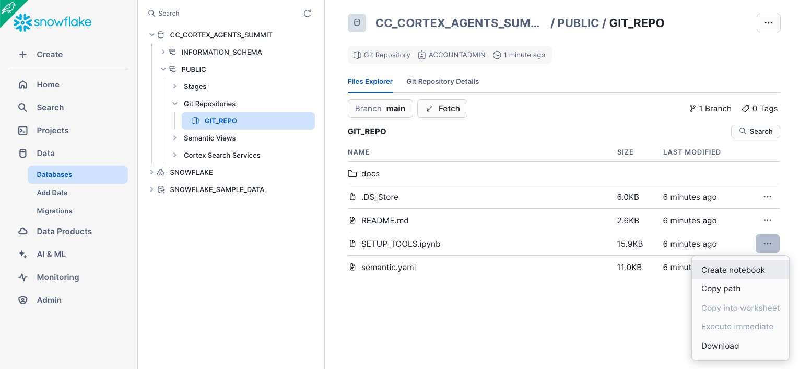
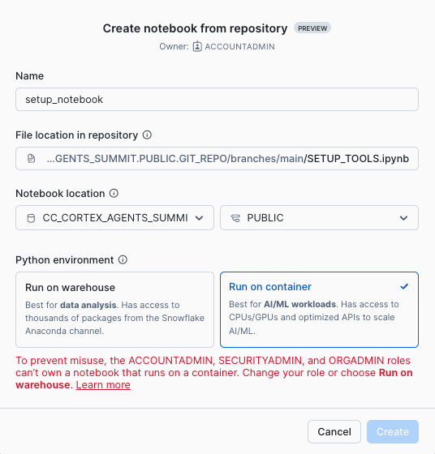
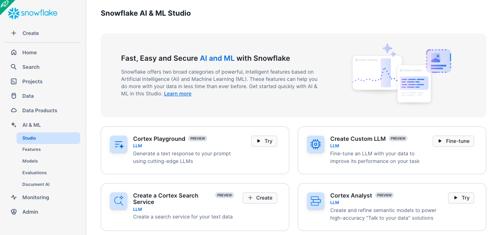
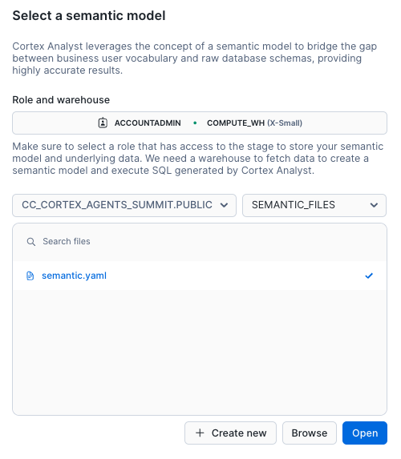
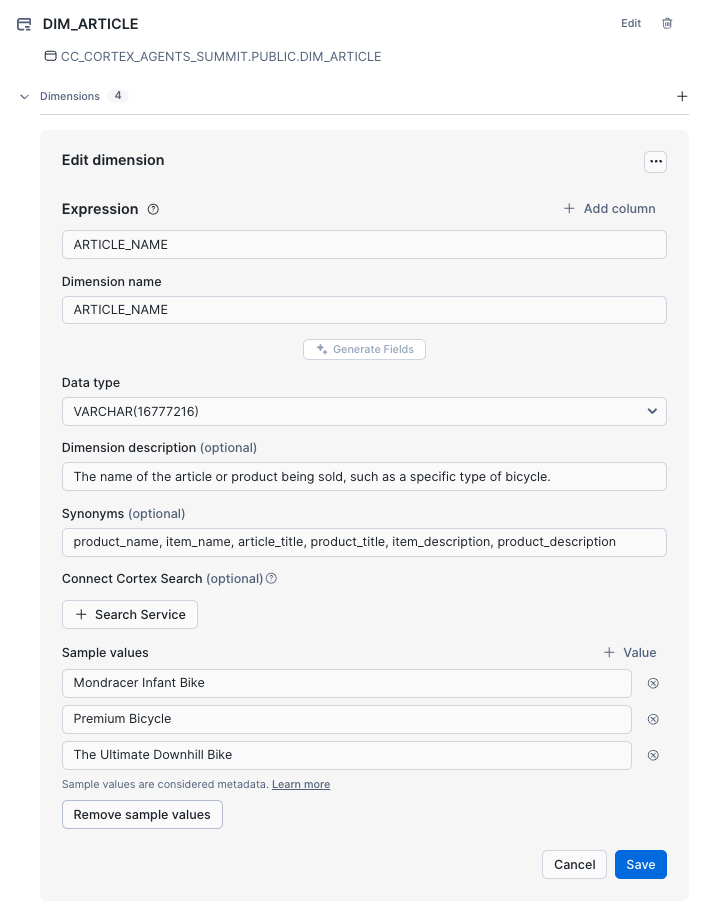
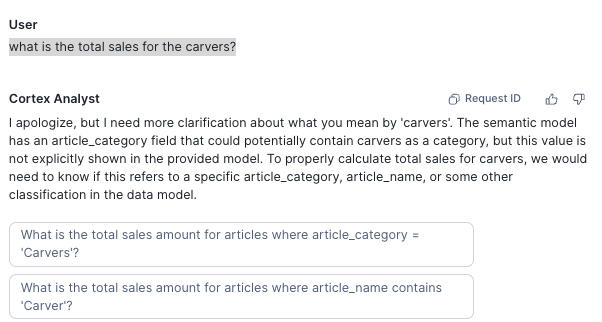
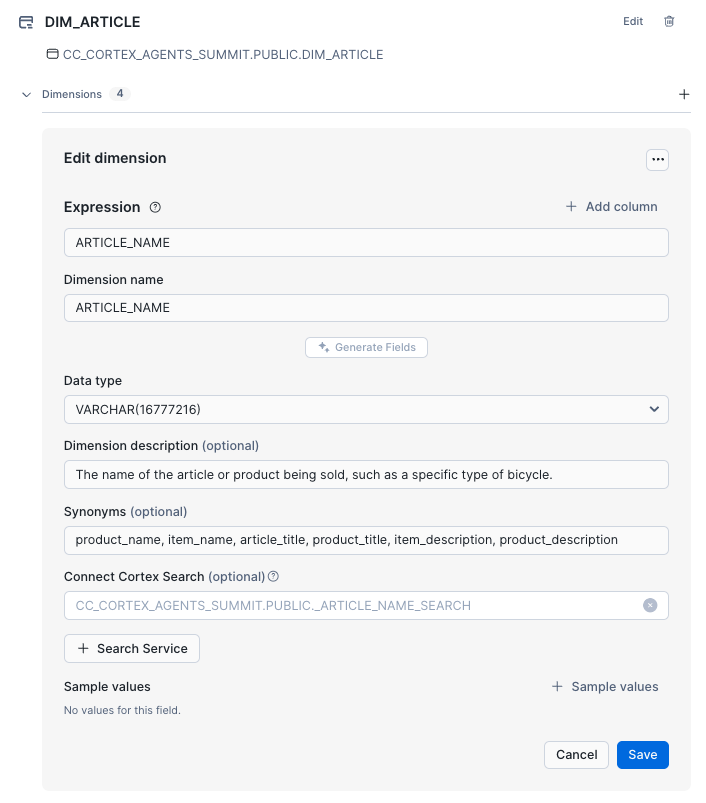
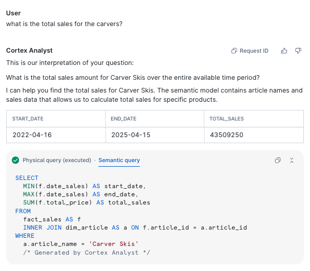
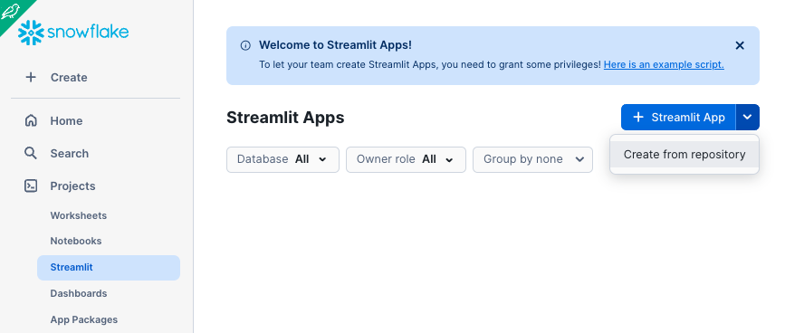
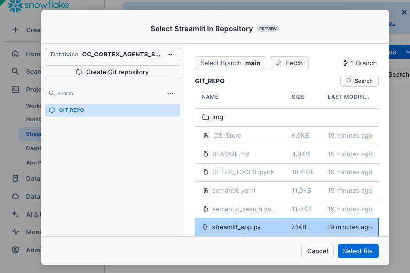

# Building Cortex Agents Hands-On Lab

This lab will explain step by step how to build a Data Agent using Snowflake Cortex Agents. You will be able to build a Data Agent that is able to use both Structured and Unstructured data to answer sales assistant questions.

First step will be to build the Tools that will be provided to the Data Agent in order to make the work. Snowflake provides two very powerfull tools in order to use Structured and Unstructured data: Cortex Analyst and Cortex Search.

A custom and unique dataset about bikes and ski will be used by this setup, but you should be able to use your own data. This artificial dataset goal is to make sure that we are using data not available within Internet, so no LLM will be able to know about our own data.

First step will be to create your own Snowflake Trial Account (our use the one provided for you during this hands-on lab). Once you have created it, you will be using Snowflake GIT integration to get access to all data that will be needed during this lab.

## Setup GIT Integration 

Open a Worksheet, copy/past the following code and execute all. This will setup the GIT repository and will copy everything you will be using during the lab.

``` sql
CREATE or replace DATABASE CC_CORTEX_AGENTS_SUMMIT;

CREATE OR REPLACE API INTEGRATION git_api_integration
  API_PROVIDER = git_https_api
  API_ALLOWED_PREFIXES = ('https://github.com/ccarrero-sf/')
  ENABLED = TRUE;

CREATE OR REPLACE GIT REPOSITORY git_repo
    api_integration = git_api_integration
    origin = 'https://github.com/ccarrero-sf/cortex_agents_summit';

-- Make sure we get the latest files
ALTER GIT REPOSITORY git_repo FETCH;

-- Setup stage for Bikes Docs
create or replace stage docs_bikes ENCRYPTION = (TYPE = 'SNOWFLAKE_SSE') DIRECTORY = ( ENABLE = true );

-- Copy the docs for bikes
COPY FILES
    INTO @docs_bikes/
    FROM @CC_CORTEX_AGENTS_SUMMIT.PUBLIC.git_repo/branches/main/docs/bikes/
    PATTERN='.*[.]pdf';

ALTER STAGE docs_bikes REFRESH;


-- Setup stage for Ski Docs
create or replace stage docs_ski ENCRYPTION = (TYPE = 'SNOWFLAKE_SSE') DIRECTORY = ( ENABLE = true );

-- Copy the docs for ski
COPY FILES
    INTO @docs_ski/
    FROM @CC_CORTEX_AGENTS_SUMMIT.PUBLIC.git_repo/branches/main/docs/ski/
    PATTERN='.*[.]pdf';

ALTER STAGE docs_ski REFRESH;

```

## Setup Tools to be Used by the Agent

We are going to be using a Snowflake Notebook to setup the Tools that will be used by the Snowflake Cortex Agents API. Open the Notebook and follow each of the cells.

Select the Notebook that you have available in your Snowflake account in the Git Repositories:



Give a name to the notebook and run it in a Container using CPUs.



Once you have run the entire Notebook and you understand each of the cells, go back to this README to continue building the Cortex Agent.

## Explore the Semantic Model to be used by Cortex Analyst Tool

Under AI & ML -> Studio, select "Cortex Analyst"



Select the existing semantic.yaml file



You can try some analytical questions to test your semantic file:

- What is the average revenue per transaction per sales channel?
- What products are often bought by the same customers?

We are going to explore the integration between Cortex Analys and Cortex Search to provide better results. If we take a look to the semantic model, click on DIM_ARTICLE -> Dimensions and edit ARTICLE_NAME:

In the Dimention you will see that some Sample values have been provided:



Let's see what happens if we ask for the following question:

- What is the total sales for the carvers?

You may have an answer like this:



Let's see what happens when we integrate the ARTICLE_NAME dimmension with the Cortex Search Service we created in the Notebook (_ARTICLE_NAME_SEARCH).

- Remove the sample values provided
- Click on + Search Service and add _ARTICLE_NAME_SEARCH

It will look like this:



Click on save, also save your semantic file (top right) and ask the same question again:

- What is the total sales for the carvers?

Notice that now Cortex Analyst is able to provide the right answer even because Cortex Search integration, we asked for "Carvers" but find that the right article to ask for is "Carver Skis":



Now we have the tools ready to create our first App that leverages Cortex Agents API.

## Setup Streamlit App that uses Cortex Agents API

Create one Streamlit App that uses the Cortex Agents API.

We are going to leverate this initial code:

[streamlit_app.py](https://github.com/ccarrero-sf/cortex_agents_summit/blob/main/streamlit_app.py)

Click on Projects -> Streamlit -> Streamlit App and "Create from repository":



Select the streamlit_app.py file:



And click on Create.


-- TBC: providing example questions.....
-- TBC: Explain the Code for the API CALLS


